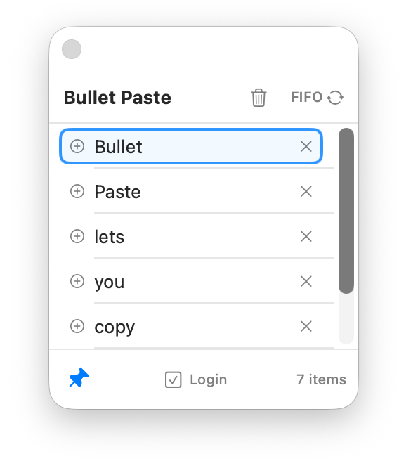

# Bullet Paste

Bullet Paste lets you copy several pieces of text in order and paste them one-by-one later:

Use Cmd+Alt+C to show or hide the tool. 

Copy items first, then paste them sequentially anywhere you need.

